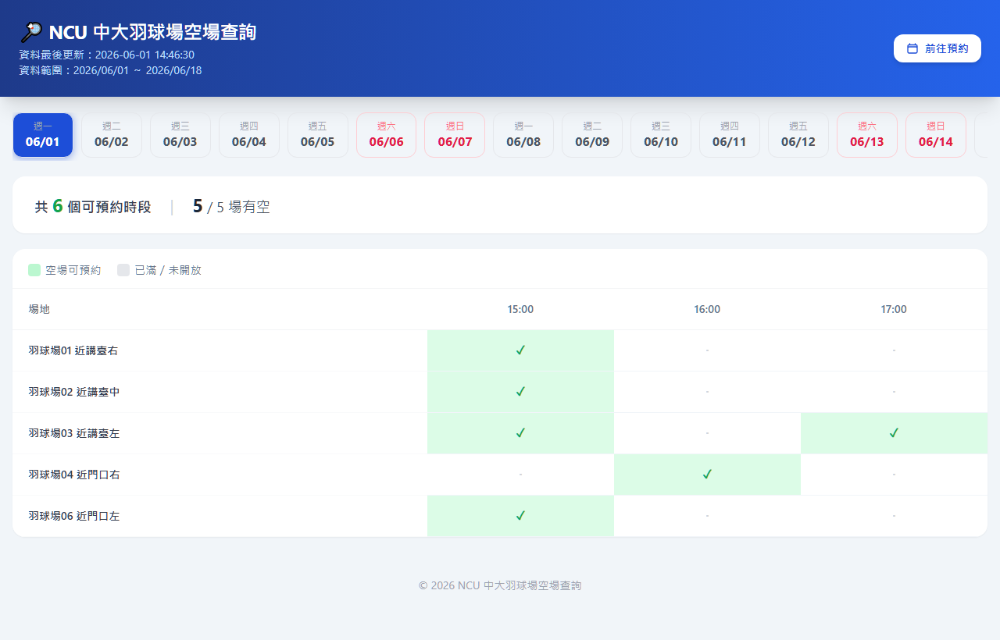

# 🏸 NCU 中大羽球場空場查詢

## 為什麼開發這個工具？

在原本的 17fit 預約系統中，要找特定時段的空場，必須**一個一個場地點進去確認**，非常耗時。

本專案透過自動化腳本定時抓取 17fit API，將主館 **5 個羽球場**（01–04、06）未來 18 天的可用時段整合在同一頁面。

## demo照片



## 技術架構

```
fetch_courts.py    → 登入 17fit、逐場抓取可用時段、輸出 slots.json
slots.json    → 前端讀取的資料源
index.html         → 查詢介面（純靜態 HTML）
server.py          → 本地端伺服器
```

## 本地端執行

### 1. 安裝相依套件

```bash
pip install -r requirements.txt
```

### 2. 建立 `.env` 檔案

```bash
# 編輯 .env，填入 17fit 帳號密碼
```

```
FIT17_ACCOUNT=你的電話或Email
FIT17_PASSWORD=你的密碼
```

### 3. 啟動本地伺服器

```bash
python server.py        # http://localhost:8080
```

瀏覽器會自動開啟。若要手動重抓資料，直接訪問 `http://localhost:8080/api/refresh`。

---

## 場地資訊（主館）

| ID | 名稱 | 位置 |
|----|------|------|
| 50116 | 羽球場01 | 近講臺右 |
| 50117 | 羽球場02 | 近講臺中 |
| 50118 | 羽球場03 | 近講臺左 |
| 50119 | 羽球場04 | 近門口右 |
| 50121 | 羽球場06 | 近門口左 |
