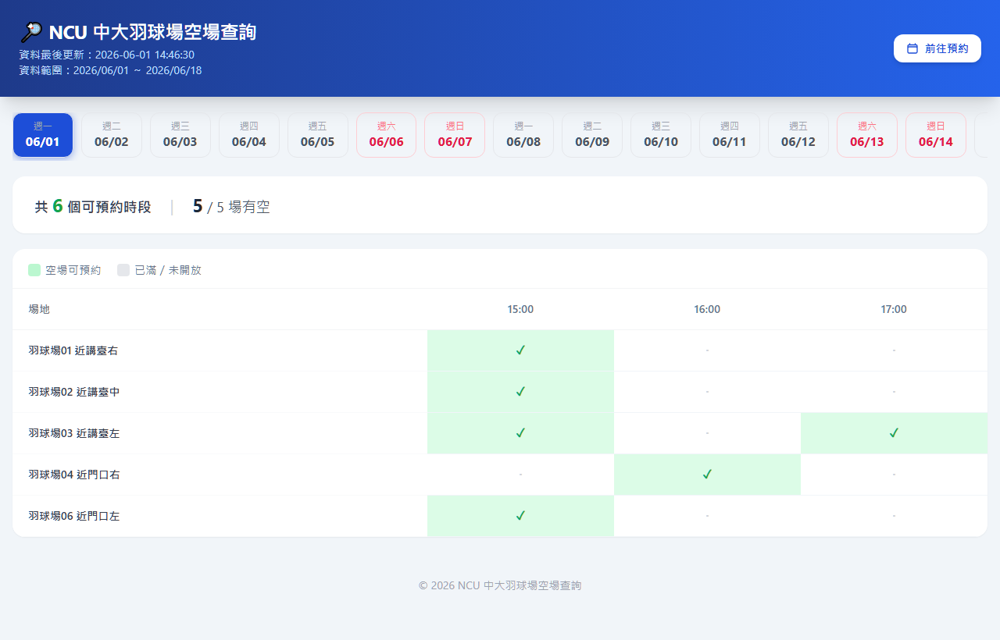

# 🏸 NCU 中大羽球場空場查詢

https://komekko1123.github.io/ncu-bmt-checker/
## 為什麼開發這個工具？

在原本的 17fit 預約系統中，要找特定時段的空場，必須**一個一個場地點進去確認**，非常耗時。

本專案透過自動化腳本定時抓取 17fit API，將主館 **5 個羽球場**（01–04、06）未來 18 天的可用時段整合在同一頁面。

## demo照片



## 技術架構

```
fetch_courts.py    → 登入 17fit、逐場抓取可用時段、輸出 slots.json
slots.json    → 前端讀取的資料源
index.html         → 查詢介面（純靜態 HTML）
server.py          → 本地端伺服器
```

## 本地端執行

### 1. 安裝相依套件

```bash
pip install -r requirements.txt
```

### 2. 建立 `.env` 檔案

```bash
# 編輯 .env，填入 17fit 帳號密碼
```

```
FIT17_ACCOUNT=你的電話或Email
FIT17_PASSWORD=你的密碼
```

### 3. 啟動本地伺服器

```bash
python server.py        # http://localhost:8080
```

瀏覽器會自動開啟。若要手動重抓資料，直接訪問 `http://localhost:8080/api/refresh`。

---

## 場地資訊（主館）

| ID | 名稱 | 位置 |
|----|------|------|
| 50116 | 羽球場01 | 近講臺右 |
| 50117 | 羽球場02 | 近講臺中 |
| 50118 | 羽球場03 | 近講臺左 |
| 50119 | 羽球場04 | 近門口右 |
| 50121 | 羽球場06 | 近門口左 |

---

## 即時查詢（Vercel）

`slots.json` 是 GitHub Actions 定時產生的快照。要讓網站當下即時反映 17fit 的狀態，
需要一層後端代跑登入 —— 因為 **17fit 完全沒有回 CORS header，且登入需要帳密**，
瀏覽器不可能直接呼叫。

```
index.html (GitHub Pages)  ──fetch──>  Vercel Function (帳密在環境變數)  ──>  17fit
```

> 原本選的是 Cloudflare Workers，但實測 **17fit 封鎖 Cloudflare 的出口網段**：
> 從 Worker 打 `17fit.com` 三個主機名一律 8 秒逾時，而同一支程式打
> `example.com` / `google.com` 都正常。改用 Vercel（東京 hnd1）後為 200 / 248ms。

### 部署

```bash
cd vercel
npx vercel login
npx vercel link --yes --project ncu-bmt-checker
npx vercel env add FIT17_ACCOUNT production
npx vercel env add FIT17_PASSWORD production
npx vercel env add ALLOWED_ORIGINS production   # https://komekko1123.github.io
npx vercel deploy --prod
```

環境變數必須在部署**之前**加，Vercel 是部署時才綁進去的。
部署後把 production alias 填進 [index.html](index.html) 的 `API_URL`；留空則停用即時查詢。

> ⚠️ 只有 production alias（`ncu-bmt-checker.vercel.app`）是公開的。
> deployment 專屬網址會被 Vercel Deployment Protection 擋成 302 導向 SSO。

### 行為

- 開頁面先秒開 `slots.json` 快照，再背景換成即時資料；切日期時只抓那一天。
- 5 個場地各自獨立 session 平行查詢（選場是寫在 session 狀態上的，不能共用）。
- session 跨請求重用，容器熱的時候不會重新登入。
- 同一日期快取 60 秒，降低對 17fit 的請求量。
- `slots.json` 抓不到時，前端會自行產生日期骨架並全靠 API 補資料。

### 實測

| | 延遲 |
|---|---|
| 冷啟動（5 場平行登入） | ~2.6s |
| 快取命中 | ~0.3s |

輸出已與 `fetch_courts.py` 逐場逐時段比對一致。

> ⚠️ 每次冷啟動都是一次帳號的真實登入。`ALLOWED_ORIGINS` 不要設成 `*`，
> 否則別人可以拿這個 API 當 proxy 打爆你的 17fit 帳號。

---

## 排程更新（GitHub Actions）

| Workflow | 時機 | 用途 |
|---|---|---|
| [main.yml](.github/workflows/main.yml) | 每小時 :17 | 例行更新 `slots.json` |
| [booking-window.yml](.github/workflows/booking-window.yml) | 每月 15 日／最後工作日 17:00 | 搶開放預約的瞬間 |

GitHub 的 cron 只保證「不早於」設定時間。原本設每 10 分鐘，實測 199 次更新的間隔
中位數是 53 分、平均 120 分，落在 15 分內的只有 0.5% —— 高頻排程會被大量丟棄，
所以改為每小時一次，即時性交給 Vercel。

booking-window 則提早 45 分鐘發車，job 起來後由 `fetch_courts.py` 的 `TARGET_TIME`
在 runner 上睡到 16:59:55，再輪詢到 17:10 為止，藉此抵銷 cron 漂移。
